# 🚨 AI-Powered SOC Incident Alert Automation

An AI-powered Security Operations Center (SOC) automation workflow built using **n8n, OpenAI, Trello, Gmail, Webhooks, and JavaScript**.

This project demonstrates how AI and workflow automation can support **L1 SOC Analysts** by automating repetitive activities involved in the initial stages of security alert handling.

The workflow receives a security alert, analyzes it using AI, evaluates the result, formats the incident information, creates an incident record in Trello, and sends a security notification through Gmail.

---

## 📌 Objective

The objective of this project is to demonstrate how **AI-powered workflow automation can reduce repetitive L1 SOC Analyst workload** during the initial alert-triage process.

The workflow automates:

**Security Alert → AI Analysis → Decision → Incident Documentation → SOC Notification**

The automation is designed to assist the analyst, not replace human investigation or response.

---

## 📌 Project Overview

Security Operations Centers receive large numbers of alerts that require initial review and triage.

L1 SOC Analysts commonly perform repetitive tasks such as:

* Reviewing security alerts
* Understanding alert details
* Performing initial triage
* Identifying suspicious activity
* Determining whether an alert appears malicious
* Documenting incidents
* Creating incident tickets
* Sending notifications
* Escalating suspicious activity

This project demonstrates how these repetitive initial activities can be automated using **n8n and AI**.

The SOC analyst remains responsible for validating the alert, performing deeper investigation, escalation, containment, and response.

---

## ⚙️ Tools Used

* **n8n** - Workflow automation
* **OpenAI** - AI-powered alert analysis
* **Webhooks** - Security alert ingestion
* **JavaScript** - Incident data formatting
* **Trello** - Incident documentation
* **Gmail** - SOC notification
* **MITRE ATT&CK** - Attack technique mapping
* **JSON** - Security alert data exchange

---

## 🏗️ Workflow Architecture

```text
                    Security Alert
                          │
                          ▼
                       Webhook
                          │
                          ▼
                 AI Security Analysis
                     (OpenAI)
                          │
                          ▼
                     IF Condition
                          │
                    True Positive
                          │
                          ▼
                 JavaScript Formatting
                          │
                          ▼
                  Trello Incident Card
                          │
                          ▼
                   Gmail SOC Alert
                          │
                          ▼
                    SOC Analyst
```

---

# 🔥 Security Alert Scenario

The workflow was tested using a simulated **SSH brute-force attack alert**.

The alert contains:

```text
Alert Type: SSH Brute Force
Source IP: 192.168.5.128
Target: Kali Lab Host
Username: admin
Failed Attempts: 25
Severity: High
MITRE ATT&CK Technique: T1110 - Brute Force
```

The scenario represents repeated failed SSH authentication attempts against a privileged account.

A high number of consecutive failed authentication attempts from a single source can indicate automated credential guessing or brute-force activity.

---

## 🔎 Alert Data

The security alert is passed to the workflow as JSON:

```json
{
  "alert_type": "SSH Brute Force",
  "source_ip": "192.168.5.128",
  "target": "Kali Lab Host",
  "username": "admin",
  "failed_attempts": 25,
  "severity": "high",
  "mitre_technique": "T1110"
}
```

This alert is received by the n8n webhook and passed to the AI analysis stage.

---

# 🧪 Workflow Implementation

## Step 1: n8n Workspace

The project was implemented using the n8n workflow automation platform.

The n8n workspace was used to create and execute the complete SOC automation workflow.

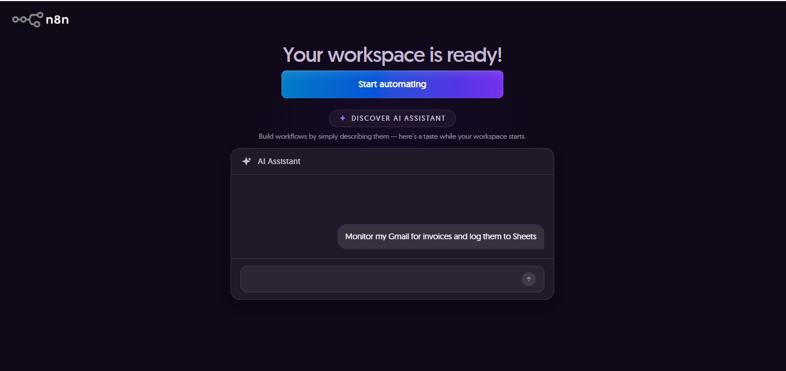

---

## Step 2: Workflow Configuration

The complete workflow connects the security alert ingestion, AI analysis, decision-making, incident documentation, and notification stages.

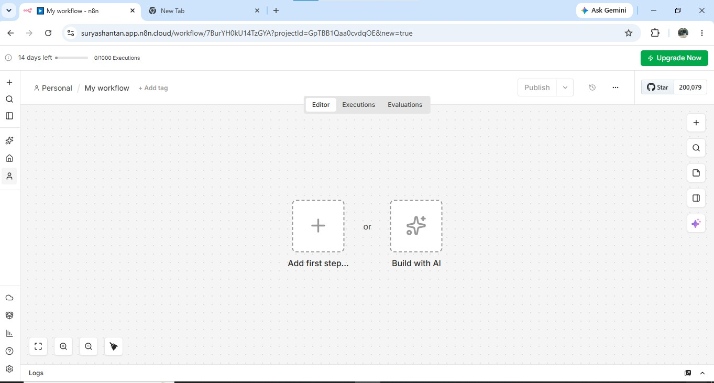

The main workflow consists of:

```text
Webhook
   ↓
OpenAI
   ↓
IF Condition
   ↓
JavaScript
   ↓
Trello
   ↓
Gmail
```

---

## Step 3: Webhook Configuration

The n8n Webhook node is configured to receive security alerts through an HTTP POST request.

The webhook acts as the entry point into the SOC automation workflow.

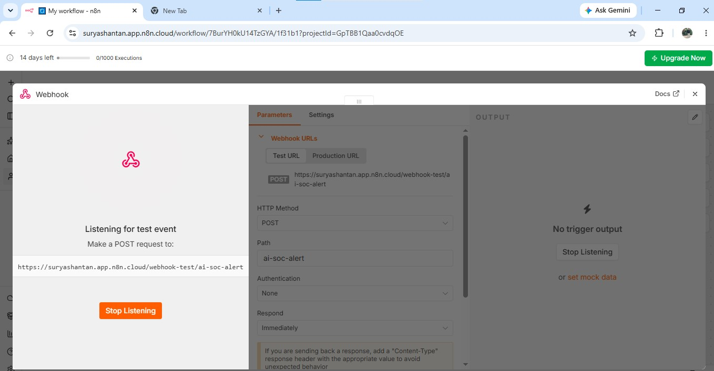

### Webhook Configuration

```text
HTTP Method: POST
Path: /ai-soc-alert
Authentication: None
Response: Immediately
```

The webhook waits for incoming security alert data.

---

## Step 4: Security Alert Received

The webhook successfully receives the simulated SSH brute-force alert in JSON format.

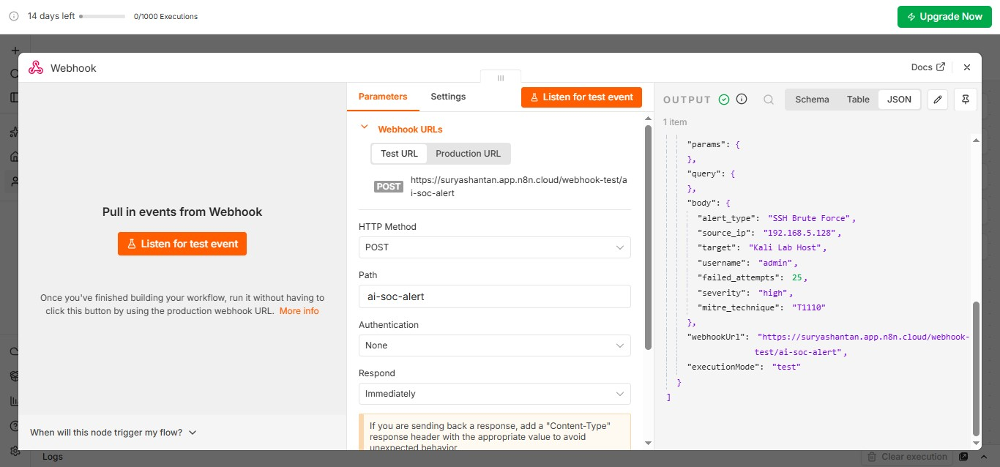

The received alert contains information such as:

```text
Alert Type
Source IP
Target
Username
Failed Attempts
Severity
MITRE ATT&CK Technique
```

This data is then passed to the AI analysis node.

---

# 🧠 Step 5: AI Security Analysis

The received alert is analyzed using an OpenAI model.

The AI performs an initial security assessment of the alert and generates a structured analysis for the SOC workflow.

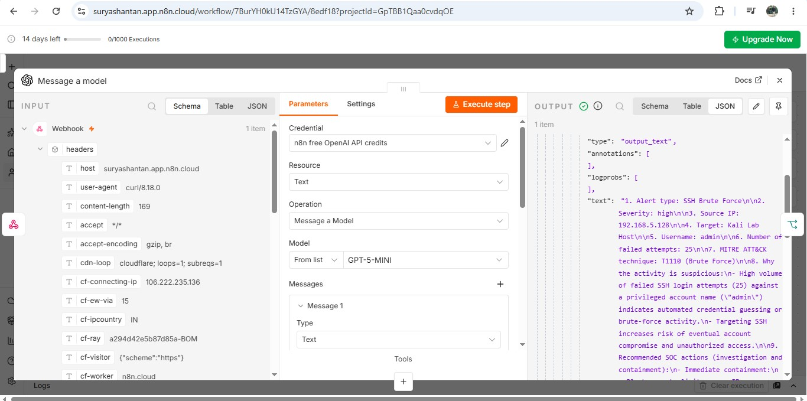

The analysis considers:

* Alert type
* Severity
* Source IP
* Target
* Username
* Failed authentication attempts
* MITRE ATT&CK technique
* Why the activity is suspicious
* Recommended SOC actions
* True positive / false positive assessment

### Example Analysis

```text
Alert Type: SSH Brute Force

Severity: High

Source IP: 192.168.5.128

Target: Kali Lab Host

Username: admin

Failed Attempts: 25

MITRE ATT&CK:
T1110 - Brute Force
```

The AI identifies the repeated failed authentication attempts as suspicious and provides recommended actions for further investigation.

---

# 🔎 Step 6: True Positive Decision

After the AI analysis, the result is passed to an **IF node**.

The IF node checks whether the AI analysis identifies the activity as:

```text
True positive
```

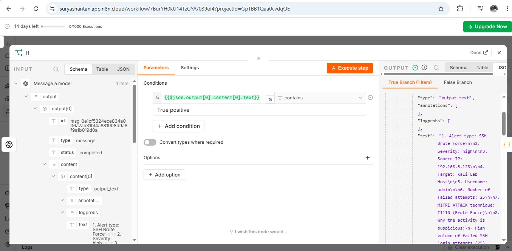

When the condition is satisfied, the workflow continues to the incident formatting and documentation stages.

This demonstrates an automated decision point within the SOC workflow.

---

# 🧾 Step 7: JavaScript Incident Formatting

A JavaScript node processes the AI-generated response and prepares structured information for the downstream nodes.

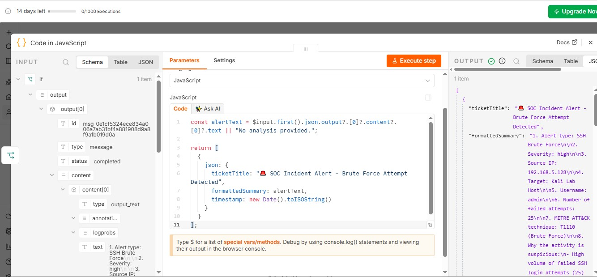

The workflow extracts the AI analysis and creates structured fields such as:

```text
ticketTitle
formattedSummary
timestamp
```

Example:

```javascript
const alertText = $input.first().json.output?.[0]?.content?.[0]?.text || "No analysis provided.";

return [
  {
    json: {
      ticketTitle: "🚨 SOC Incident Alert - Brute Force Attempt Detected",
      formattedSummary: alertText.toString(),
      timestamp: new Date().toISOString()
    }
  }
];
```

This allows the processed security information to be passed into the incident management stage.

---

# 📋 Step 8: Trello Incident Documentation

After the alert is classified as a true positive, the workflow creates an incident card in Trello.

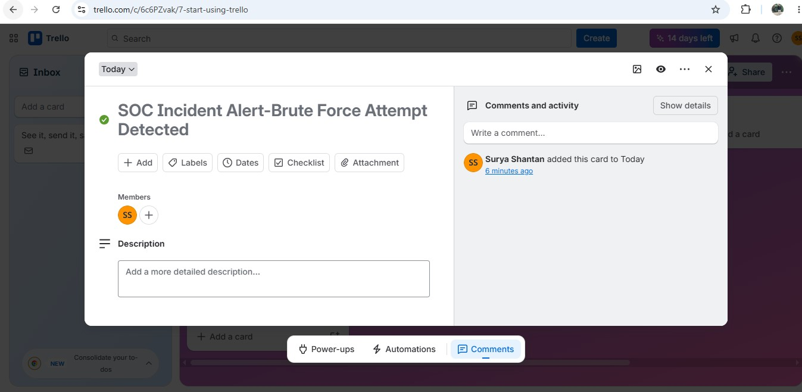

Example incident title:

```text
🚨 SOC Incident Alert - Brute Force Attempt Detected
```

The Trello card provides a trackable incident record containing the AI-generated security analysis.

This demonstrates how a raw security alert can automatically become an incident record.

---

# ✅ Step 9: Trello Incident Created Successfully

The workflow successfully creates the incident card in Trello.

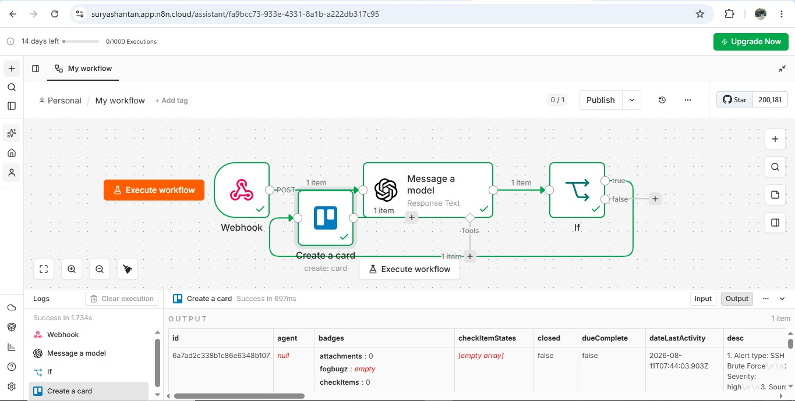

The incident record can then be reviewed by the SOC analyst for further investigation and response.

---

# 📧 Step 10: Gmail SOC Notification

After creating the incident record, the workflow sends a security notification through Gmail.

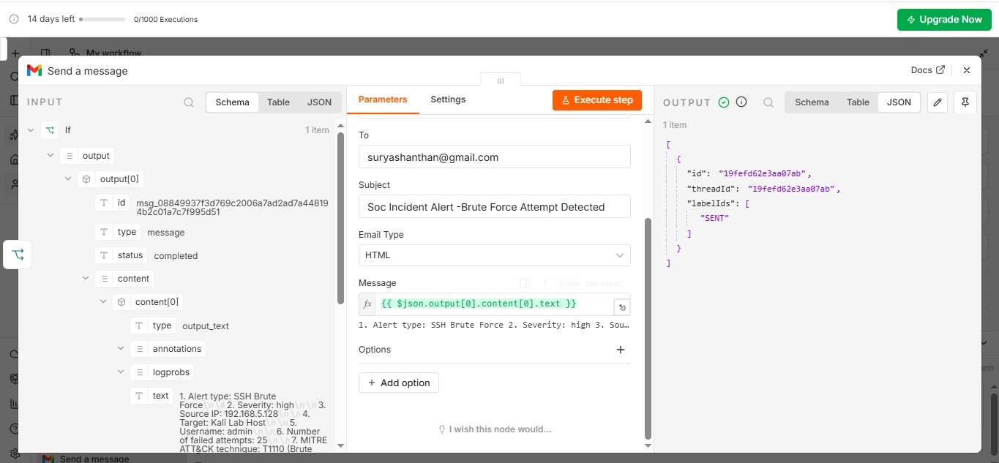

The notification contains the processed security analysis.

The email can include:

* Alert type
* Severity
* Source IP
* Target
* Username
* Failed attempts
* MITRE ATT&CK technique
* Suspicious activity explanation
* Recommended SOC actions
* True positive / false positive assessment

---

# 🔔 Step 11: Complete Workflow Execution

The complete n8n workflow was executed successfully.

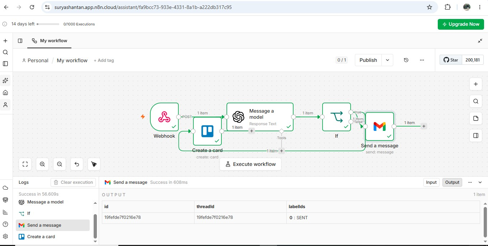

The successful execution demonstrates the complete automation chain:

```text
Security Alert
      ↓
Webhook
      ↓
OpenAI Analysis
      ↓
IF Decision
      ↓
JavaScript Formatting
      ↓
Trello Incident
      ↓
Gmail Notification
```

---

# 📬 Step 12: Final SOC Alert Received

The final Gmail notification was successfully received with the processed security incident information.

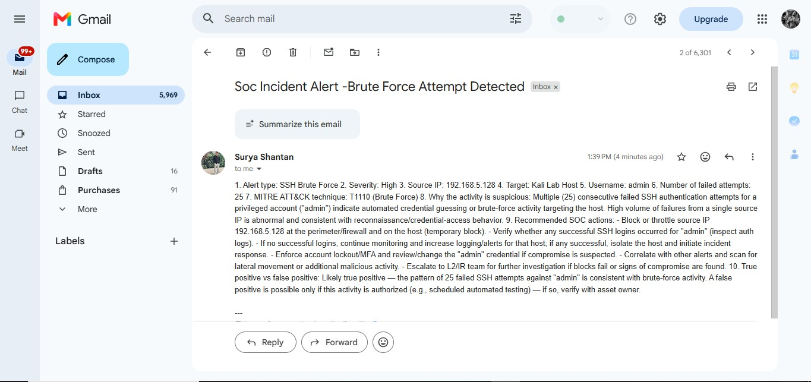

The notification provides the SOC analyst with the initial alert analysis and recommended investigation actions.

---

# 🛡️ SOC Use Case

## SSH Brute-Force Detection

### Scenario

An attacker repeatedly attempts to authenticate to an SSH service using the `admin` account.

### Observed Activity

```text
Attack Type: SSH Brute Force
Source IP: 192.168.5.128
Target: Kali Lab Host
Username: admin
Failed Attempts: 25
Severity: High
MITRE ATT&CK: T1110
```

### Automated Processing

```text
SSH Brute-Force Alert
          ↓
      Webhook
          ↓
    AI Analysis
          ↓
   True Positive
          ↓
Incident Formatting
          ↓
  Trello Incident
          ↓
 Gmail Notification
          ↓
    SOC Analyst
```

The workflow automates the repetitive initial alert-handling process while leaving final investigation and response to the analyst.

---

# 🚨 Recommended SOC Actions

Once the alert is received, the SOC analyst should validate the activity and perform further investigation.

Recommended actions include:

* Verify the source IP
* Review SSH authentication logs
* Check for successful logins after failed attempts
* Investigate the affected account
* Determine whether the activity was authorized
* Search for additional suspicious activity
* Review related security alerts
* Consider blocking the source IP when appropriate
* Protect or reset compromised credentials
* Enable MFA where supported
* Escalate confirmed compromise to the appropriate response team

The automation provides **initial triage assistance** and does not perform autonomous incident response.

---

# ⚠️ False Positive Consideration

Not every brute-force-like authentication pattern is necessarily malicious.

Possible legitimate causes include:

* Authorized penetration testing
* Security testing
* Automated administrative systems
* Scheduled vulnerability assessments
* Internal security testing

The SOC analyst should validate the alert before performing containment or remediation.

---

# 📈 Benefits

This automation can help SOC teams by:

* Reducing repetitive manual alert processing
* Speeding up initial triage
* Providing AI-assisted alert analysis
* Improving consistency in incident documentation
* Automatically creating incident records
* Automatically notifying analysts
* Standardizing the initial alert-handling process
* Allowing analysts to focus on deeper investigation and response

---

# 🧑‍💻 Skills Demonstrated

This project demonstrates practical experience with:

* SOC alert triage
* Security alert automation
* AI-assisted security analysis
* n8n workflow automation
* Webhook-based alert ingestion
* OpenAI integration
* JSON security events
* JavaScript data processing
* Incident documentation
* Trello automation
* Gmail automation
* MITRE ATT&CK mapping
* SSH brute-force analysis
* True positive / false positive analysis
* L1 SOC workflow concepts
* Security incident notification

---

# 🔄 End-to-End Workflow Summary

```text
                ┌─────────────────────┐
                │   Security Alert    │
                │  SSH Brute Force    │
                └──────────┬──────────┘
                           │
                           ▼
                ┌─────────────────────┐
                │       Webhook        │
                │    Alert Ingestion   │
                └──────────┬──────────┘
                           │
                           ▼
                ┌─────────────────────┐
                │    OpenAI Model      │
                │   AI Alert Analysis  │
                └──────────┬──────────┘
                           │
                           ▼
                ┌─────────────────────┐
                │    IF Condition      │
                │  True Positive?      │
                └──────────┬──────────┘
                           │
                           ▼
                ┌─────────────────────┐
                │     JavaScript       │
                │ Incident Formatting  │
                └──────────┬──────────┘
                           │
                           ▼
                ┌─────────────────────┐
                │       Trello         │
                │  Incident Creation   │
                └──────────┬──────────┘
                           │
                           ▼
                ┌─────────────────────┐
                │       Gmail         │
                │  SOC Notification   │
                └──────────┬──────────┘
                           │
                           ▼
                ┌─────────────────────┐
                │    SOC Analyst      │
                │ Investigation/IR    │
                └─────────────────────┘
```

---

# 📂 Project Structure

```text
AI-Powered-SOC-Incident-Alert-Automation/
│
├── README.md
│
└── screenshots/
    │
    ├── 01-n8n-workspace-ready.jpg
    ├── 02-workflow-editor.jpg
    ├── 03-webhook-listening.jpg
    ├── 04-webhook-receives-alert.jpg
    ├── 05-ai-security-analysis.jpg
    ├── 06-if-true-positive.jpg
    ├── 07-javascript-formatting.jpg
    ├── 08-trello-test-card.jpg
    ├── 09-trello-card-created.jpg
    ├── 10-email-notification-sent.jpg
    ├── 11-full-workflow-success.jpg
    └── 12-gmail-alert-received.jpg
```

---

# 🔒 Security & Privacy

This project uses simulated security alert data for demonstration purposes.

Do not commit:

* API keys
* OpenAI credentials
* Gmail credentials
* Trello tokens
* Webhook secrets
* Passwords
* `.env` files
* Production security logs
* Confidential organizational information

Credentials should be stored securely using n8n credentials, environment variables, or an appropriate secrets-management solution.

---

# 📌 Key Takeaway

This project demonstrates how **AI and workflow automation can support L1 SOC operations** by automating repetitive initial alert-handling tasks.

The workflow takes a security alert through:

**Ingestion → AI Analysis → Decision → Incident Documentation → Notification**

This allows the SOC analyst to receive a structured and documented security incident while focusing their time on the activities that require human judgment:

**Validation → Investigation → Escalation → Containment → Response**

---

# 📌 Conclusion

The **AI-Powered SOC Incident Alert Automation** project demonstrates the practical integration of cybersecurity, artificial intelligence, and workflow automation.

By combining **n8n, OpenAI, Webhooks, JavaScript, Trello, and Gmail**, the workflow automates several repetitive tasks involved in initial SOC alert handling.

The project demonstrates how automation can improve the speed and consistency of initial alert processing while keeping the human SOC analyst responsible for final validation, investigation, escalation, and response.

---

## 👤 Author

**Surya Shantan**

Cybersecurity / SOC Analyst (L1) Candidate

**GitHub:**
https://github.com/suryashantan

**LinkedIn:**
https://www.linkedin.com/in/surya-shantan-46161426

---

⭐ If you find this project useful, consider giving the repository a star.
